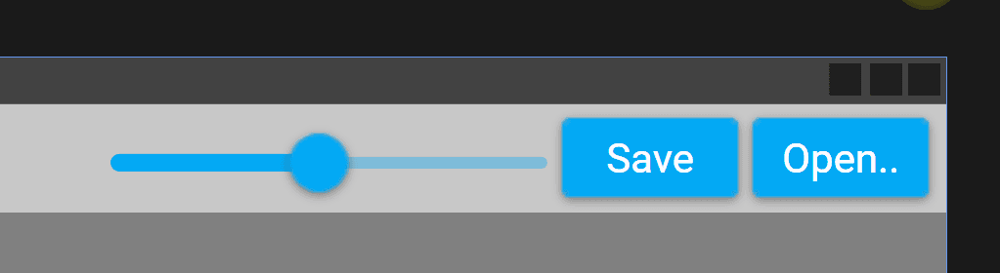
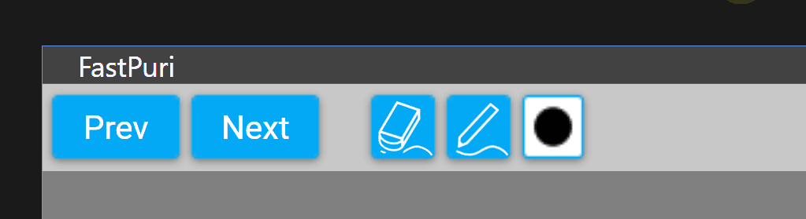
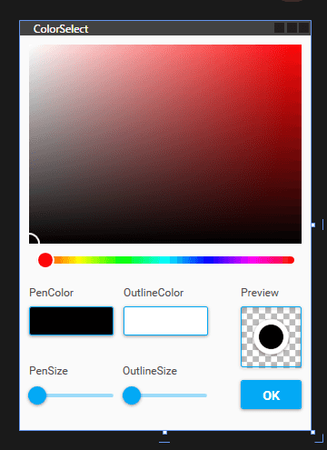

# FastPuri

画像にサクサク描き込みをするためのアプリ  
プリクラの挙動をモチーフに赤ペン先生的な用途を想定してます  


## 使い方

~~①Releasesから最新の"FastPuri.zip"をダウンロード~~  
~~②zipを解凍して中のFastPuri.exeを任意の場所に移動させる~~  
~~③FastPuri.exeをダブルクリックで起動（インストールは不要）~~  
  
察してください。  
いずれWindowsStoreにリリースします。それまではSmartScreenと戦ってね…  
  
  ---------------------
  


### 画像の選択
```
右上、[Open..]で描き込みしたい画像を開く（ローカルに保存された画像のみ対応）
├*.jpg、*.jpeg、*.pngに対応
└引数（画像を右クリック→プログラムから開く）には非対応（いずれ対応予定）
```

### 拡大と縮小
```
右上、スライダーを使って拡大縮小
└書き込んだペンの解像度と画像の解像度が異なると書き出し後思うような線にならないので注意
```

### 画像の保存
```
右上、[Save]で画像を上書き保存
├設定から上書きかリネームか選べる（予定）
├一度保存した線はこのソフトの消しゴムでは消せなくなるので注意
└元画像はゴミ箱に送られるため世代戻りによる復元は可能
```
  
  ---------------------
  


### ペンと消しゴム
```
左上、中央側のボタンで消しゴム／ペンモードの切り替え
└消しゴムモードをクリックするたびにStrokeとPointを切り替え
```

### 画像送り
```
左上、[Prev][Next]ボタンで画像送り
└変更が保存されていない場合ダイアログを表示
```
  
  ---------------------
  



### 色の変更/アウトラインの調整
```
左上、ペンアイコンの隣。クリックで別ウィンドウが開く
├ペンとアウトラインで別々の色を指定できる、画面上のボタンで変更する方の色をクリック
├下部のスライダーでペンの太さ、アウトラインの太さを調整、アウトラインの太さはペンの太さとの和
└ウィンドウの☓で閉じた場合変更が反映されず、[OK]をクリックで反映される
```

  ---------------------
  
  ## プライバシーポリシー　Privacy Policy
  このアプリケーションは個人情報を収集・公開いたしません。
  This application does not collect or publish any personal information.
  
  ---------------------
  
## プロジェクト概要
```
.NET 4.8
Windows Presentation Foundation
```
    
  ---------------------
  
## Thanks!!

### [MaterialDesignInXAML](https://github.com/MaterialDesignInXAML/MaterialDesignInXamlToolkit)
### [Costura.Fody](https://github.com/Fody/Costura)
